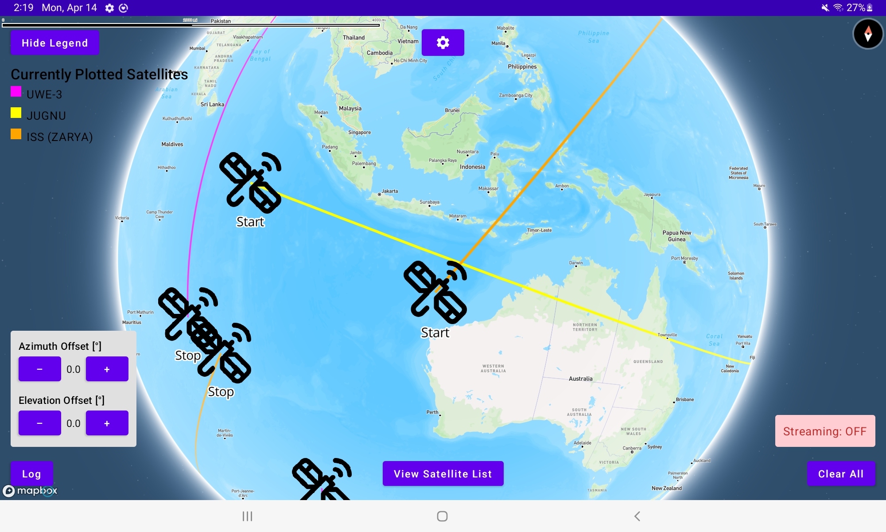
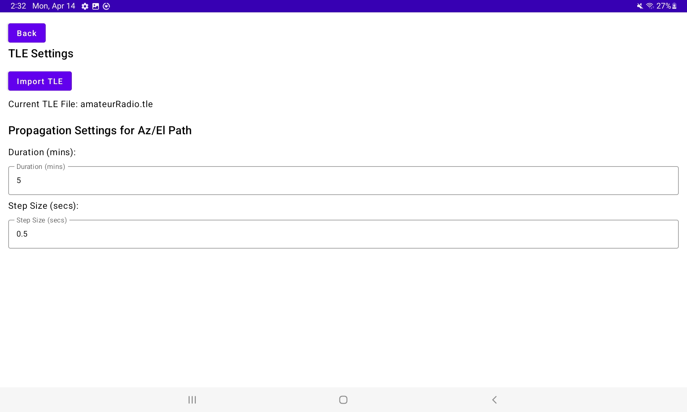
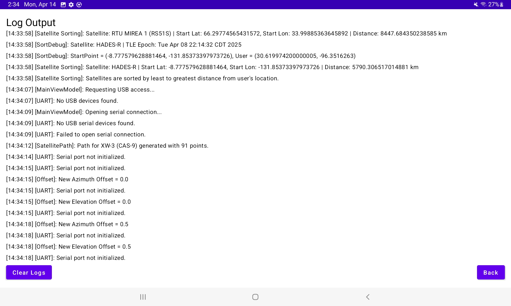
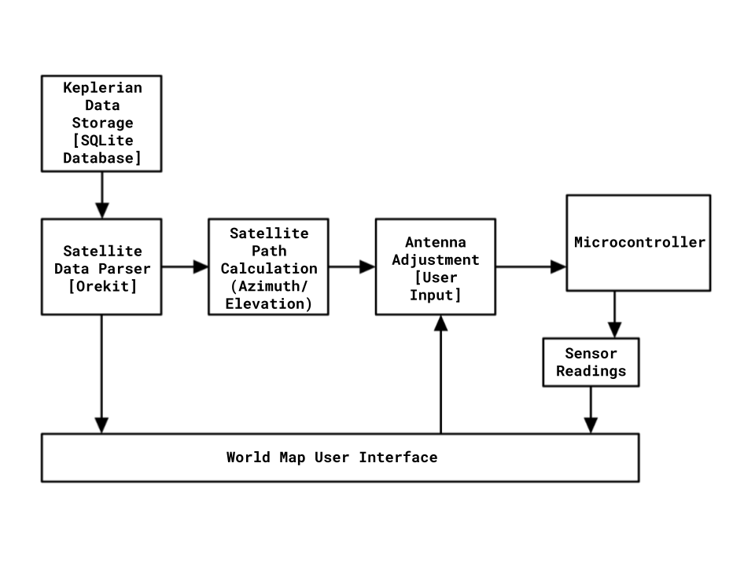

# Android Satellite Tracking Mount Application

## Overview

Android application that acts as the **interface, database, and control system** for an automatic satellite tracking mount. The app displays satellites and their paths on an interactive world map, computes tracking paths from Keplerian Two-Line Element (TLE) data, and sends commands to a microcontroller to control antenna positioning in real-time.

---

## Key Features

- **Offline Operation**: Designed to work without WiFi or mobile data, enabling reliable use in field conditions.
- **TLE Database**: Preloaded with amateur radio TLE datasets. Users can import `.tle` files, which are parsed into satellite objects and stored locally.
- **Interactive World Map UI**: Touch-interactive map with pinch-to-zoom and pan, displaying current location and plotted satellite paths.
- **Satellite Path Plotting**: 90-minute orbital paths, color-coded per satellite with start/stop markers.
  Path Plotting → 
- **Settings Page**: Import new TLE datasets, adjust path propagation parameters (tracking duration, step size).
  Settings Page → 
- **Log Page**: Displays TLE import logs, settings changes, and azimuth/elevation propagation outputs.
  Log Page → 
- **Path Propagation (Az/El)**: Generates satellite tracking paths relative to user’s position and sends them to the microcontroller.
- **UART Communication**: Transmits propagated satellite paths via USB-C serial connection to the mount’s microcontroller.
- **Manual Adjustment**: After propagation, users can manually adjust antenna tracking paths from the UI.
  

---

## Validation

- **TLE Parsing**: Validated against [Celestrak](https://celestrak.org/) orbital datasets with high accuracy.
- **Path Propagation**: Compared against SatPC32 outputs (PC software) — deviations minimal and caused by interval differences.
- **UI**: Tested across multiple Android devices (portrait/landscape modes, zoom limits, user location display). Satellite list sorted by proximity for efficient tracking.

**Sample Validation Data (Application vs SatPC32):**
| Azimuth (App) | Azimuth (SatPC32) | Elevation (App) | Elevation (SatPC32) |
|---------------|-------------------|-----------------|---------------------|
| 36.2315° | 36.4215° | 8.0241° | 8.0522° |
| 37.9122° | 38.0011° | 8.7354° | 8.7798° |
| 38.6904° | 38.6685° | 9.4634° | 9.5041° |
| 39.1109° | 39.1210° | 10.2413° | 10.3114° |

---

## Advantages

- **Mobile-first**: Unlike PC-only software (e.g., SatPC32), this runs on Android phones and tablets for portability.
- **Touch-interactive UI**: More intuitive navigation and faster control in field conditions.

## Limitations

- Fewer advanced satellite-tracking features compared to PC software due to hardware constraints of mobile devices.

---

## Future Features

- **Database Operations**: Add/remove satellites directly within the app.
- **Support for Additional Filetypes**: Import `.csv`, `.xml`, and `.kvn` TLE datasets.
- **Automatic TLE Updates**: Download updated datasets when connected to the internet.

---

